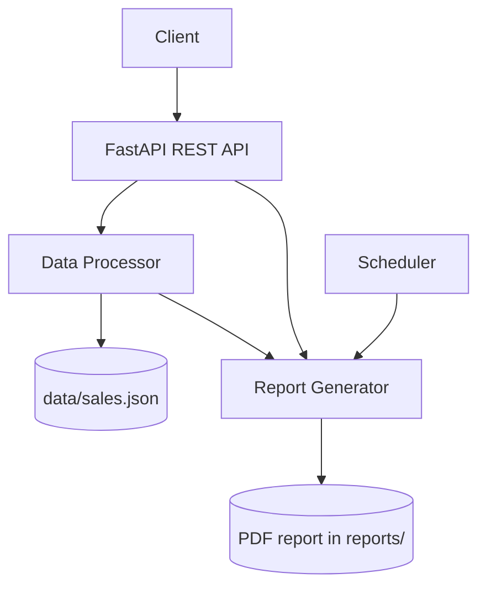

# Enterprise Automation

## Project Description

An automated PDF report generation system built using Python and FastAPI.

## Features

- FastAPI REST API
- JSON data processing
- Automated PDF generation
- Automatic scheduling
- Sales calculation
- API documentation
- Modular project architecture

## Installation

Install the dependencies from this directory:

```bash
pip install -r requirements.txt
```

## Run

Start the API from this directory:

```bash
uvicorn main:app --reload
```

## API

- `GET /` checks that the API is running.
- `GET /generate-report` generates a sales PDF report.
- `GET /start-automation` starts recurring report generation every ten minutes.

## Documentation

Open [http://127.0.0.1:8000/docs](http://127.0.0.1:8000/docs) for the interactive API documentation.

## Architecture


